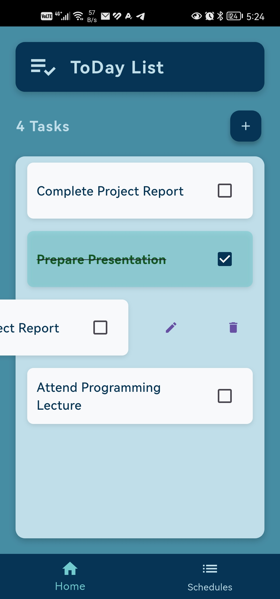

# Today Flutter App  

  

## About the Project  
**Today** is a **task management application** built with **Flutter**, designed to help users **organize their daily tasks efficiently**. The app provides a **simple, user-friendly interface** that makes it easy to create, edit, and track tasks seamlessly.  

This system offers a structured way to **prioritize and manage tasks**, ensuring that users stay productive throughout the day. While it currently operates with local storage, future updates will introduce **cloud-based synchronization and improved scheduling** for a more flexible experience.  

## Features  
✔ **Minimalistic and modern UI** for an intuitive user experience  
✔ **Task creation, editing, and completion tracking**  
✔ **Task prioritization and categorization** for better organization  
✔ **Local storage with SQLite** for offline usage  
✔ **Planned backend integration** for cloud access  
✔ **Fully responsive design** adaptable to different screen sizes  

## Tech Stack  
- **Flutter (Dart)** – Frontend framework  
- **Provider** – State management  
- **SQLite** – Local database for storing tasks  
- **Laravel (Planned)** – Backend for cloud synchronization  
- **Firebase (Planned)** – Authentication & push notifications  

## Installation  
To run the project locally, follow these steps:  

1️⃣ Clone the repository:  
   ```bash
   git clone https://github.com/Ziad-Abaza/today-flutter-app.git
   ```  
2️⃣ Navigate to the project directory:  
   ```bash
   cd today-flutter-app
   ```  
3️⃣ Install dependencies:  
   ```bash
   flutter pub get
   ```  
4️⃣ Run the application:  
   ```bash
   flutter run
   ```  

## Future Enhancements  
✨ **Push notifications** to remind users of pending tasks  
✨ **Improved scheduling system** for better time management  
✨ **Cloud-based backend using Laravel** for remote task access  
✨ **Cross-device synchronization** to manage tasks from any platform  
✨ **User authentication system** to personalize the experience  

## Open for Contributions  
This project is **open for further development**, and I welcome contributions from developers who wish to enhance its features. Whether it's improving UI, optimizing backend functionality, or adding new features, **your input is valuable!**  

## About This Project  
This app was created as a **training project** to apply **Flutter concepts**, including **state management, local storage, and UI design**. While my upcoming **university project** will be inspired by **Dubizzle (formerly OLX)**, **Today** focuses entirely on **task management and productivity**.  

I plan to continue improving the app, making it a more **robust and efficient** task management system. 🚀  

---

📌 **Stay tuned for future updates and improvements!**